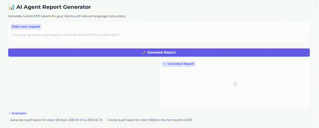

# 📊 AI Agent Report Maker - Deploy Edition

## Overview
This project extends an initial implementation developed for a hackathon ([Full project](https://github.com/ezemriv/AI-Agent-Report-Maker-Full)), where the core functionality of generating reports based on natural language prompts was introduced. In this modified version, additional functionality has been added to allow the AI agent to **extract the client ID directly from the input prompt**, enhancing the app's usability and accuracy.

The **AI Agent Report Generator** is a Python-based application that allows users to create custom PDF reports for clients using natural language prompts. Powered by an AI agent, this app interprets instructions, extracts essential information (e.g., client ID and date range), and generates a comprehensive report that includes visual data summaries. The interface is built using **Gradio**, making it simple and accessible from any web browser.

## 🚀 Example of Running App

<p align="center">
  
</p>

## ✨ Features
- **Natural Language Input**: Generate reports using plain text instructions, e.g., _"Generate a PDF report for client 126 from 2010-01-01 to 2014-02-01"_.
- **Automatic Data Extraction**: The AI agent identifies client ID and date range from the input prompt.
- **Visual Data Summaries**:
  - Earnings and expenses summary plot
  - Expenses by merchant category plot
  - Cash flow summary
- **PDF Report Generation**: The app compiles data and visual summaries into a downloadable PDF report.
- **User-Friendly Interface**: Features a Gradio interface with an input textbox, a status display, and easy PDF download access.

## 🗂️ Project Structure

```plaintext
project/
│
├── app.py                   # Main application file for Gradio
├── requirements.txt         # Dependencies
├── README.md                # Project description and setup instructions
├── config.py                # Configuration (paths, settings)
│
├── data/
│   └── sample_transactions_data.csv      # Sample dataset only for clients 126 and 1556, dates 2010-01-01 to 2019-10-31
│   └── mcc_codes.json      # Merchant category codes
│
├── reports/                 # Output folder for generated reports and figures
│
├── utils/
│   ├── tools.py     # Input preprocessing and pdf generation functions
│   ├── data_functions.py   # Client data extraction functions
│   └── agent.py          # Main AI agent logic
```

---

## 🛠️ Setup Instructions

1. **Clone the Repository**:
   ```bash
   git clone https://github.com/ezemriv/AI-Agent-Report-Maker-Deploy.git
   cd AI-Agent-Report-Generator
   ```
2. **Set up a Virtual Environment**
   - Create and activate a virtual environment for managing dependencies.
   ```bash
   python -m venv venv
   source venv/bin/activate  # On Windows: venv\Scripts\activate
   ```
3. **Install Dependencies**
   - Install all necessary Python packages listed in `requirements.txt`.
   ```bash
   pip install -r requirements.txt
    ```

4. **Download the Llama Model**
   - Ensure you have the **Llama 3.2:1b** model available locally for the AI agent.
   - Download the model by running the appropriate `ollama` command.
   ```bash
   ollama pull llama3.2:1b
    ```

5. **Run the Application**
   - Start the application locally and open the provided URL in your web browser to access the Gradio interface.
   ```bash
   python app.py
   ```
   - The app will launch locally. Open the URL (e.g., http://127.0.0.1:7861) in a web browser to access the Gradio interface.

---

## 🚀 Usage Guide

1. **Enter a Prompt**:
   - Example: _"Generate a PDF report for client 126 from 2010-01-01 to 2014-02-01"_

2. **Click "Generate Report"**:
   - The app will display a status message, e.g., "✅ Report generated successfully for client 126. Period: 2010-01-01 to 2014-02-01."

3. **Download the PDF**:
   - Once generated, the PDF report will be available to download. The report includes data tables and visual summaries.

## 🎨 Gradio Interface Details

- **Text Prompt**: Input field to enter instructions in natural language.
- **Generate Report Button**: Initiates report generation based on the input prompt.
- **Status Display**: Provides real-time feedback, including success messages or error notifications.
- **PDF Viewer/Download**: Allows users to download the generated PDF report.

## 📝 Example Prompts

Here are some example prompts to try:
- _"Generate a PDF report for client 126 from 2010-01-01 to 2014-02-01"_
- _"Create a PDF report for client 1556 for the first month of 2011"_

## 📄 PDF Report Contents
The generated PDF report includes:
- **Earnings and Expenses Summary**: A breakdown of total earnings and expenses.
- **Expenses by Merchant Category**: Detailed expenses categorized by merchant.
- **Cash Flow Summary**: Inflows, outflows, and net cash flow for the specified period.
- **Plots and Visual Summaries**: Bar plots for quick insights.

## ⚙️ Configuration
The paths and settings are managed in `config.py`, which includes:
- **Data Paths**: Location of sample data and merchant codes.
- **Reports Folder**: Directory where generated reports and plots are saved.
- **Model Settings**: AI model configuration, including temperature.

## 🐛 Troubleshooting
If you encounter issues:
- Ensure that `DATA_PATH` in `config.py` points to `sample_transactions_data.pkl`.
- Check that all required directories (`reports/`, `figures/`) exist or are created by the app.
- Verify that the AI model is configured correctly in `config.py`.

## 🙏 Acknowledgments
This project extends an initial version developed for a hackathon. Special thanks to the organizers from CaixaBank Tech and Nuwe.
